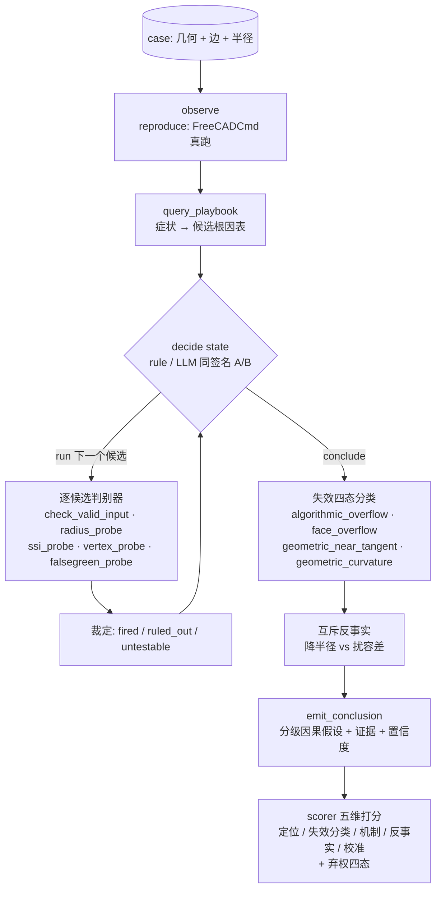

# 圆角缺陷根因调研 Agent（fillet root-cause investigation agent）

> **What this is**: a deterministic tool layer + decision loop that localizes *why* an OCCT/FreeCAD fillet or chamfer fails — which pipeline stage (S0–S6) broke first and why — and emits a graded causal hypothesis with verifiable evidence. A 5-dimension eval harness scores the diagnosis and a rule-vs-LLM A/B shares one decision seam. Runtime: macOS Apple Silicon.
> **这是什么**：一套定位「圆角失败发生在流水线哪一阶段、为什么」的根因调研 agent + 量化 eval。目标不是「把圆角修好」，而是产出**可验证、可打分、可被人工 review 的因果结论**。运行环境仅维护 macOS Apple Silicon。

## 5 分钟架构（5-minute architecture）



## 快速开始（Quick start）

前置：本机有 debug FreeCADCmd + occ-debug-mesh（一条命令 `scripts/bootstrap.sh` 就位；依赖关系见 [../docs/dependencies.md](../docs/dependencies.md)）。**仅支持/维护 macOS Apple Silicon**；Linux CI 只跑离线单测门，不承诺可运行。

```bash
# 合成 case 诊断（builder id：box / wedge / pocket …）
python -m agent.loop.investigate box 5

# 你自己的模型诊断（BREP/STEP + 指定边 + 半径；边号 N = GUI 里的 EdgeN，1-based）
python -m agent.loop.investigate "brep:/abs/path/m.brep" 5 --edges 3

# 全量测试（24 模块，缺二进制自动 SKIP）
bash scripts/run-agent-tests.sh

# 全量 eval（13 case 真值集，五维 + 弃权四态分层打分）
bash agent/eval/eval.sh
```

诊断输出是**结论不是分数**：根阶段 + 失效四态 + 对症修法 + 证据链（每条证据锚到 artifact + source 行）。

## 四条核心设计（面试/读者最该看的）

1. **成功判据 = 几何有效性（S6），禁用裸 `IsDone()`** —— `IsDone()=true` 但几何自交的「假绿」是经典代理奖励陷阱，全项目以 `check_valid`（BRepCheck + 面面自交检测）为唯一 reward signal。
2. **根因 ≠ 修法** —— 「降半径修好了」证明不了根因；只有**互斥靶向反事实**（降半径 × 扰容差四组合）能把 S2/S3 判别开。
3. **模型只在决策点** —— `decide(state)` 是唯一接缝，rule 版（顺序穷尽）与 LLM 版（claude_cli/replay/api 三后端，record/replay 保证确定性）同签名可 A/B；其余全部确定性。
4. **弃权是一等结果** —— 证据不足停在能站住的层（`abstained`），eval 用弃权四态（correct_abstain / false_commit / wrong_abstain / correct_commit）单独计量，与定位分账。

## 分数现状（2026-07 实测，rule 臂；LLM replay 臂质量维逐位持平）

| 指标 | 值 |
| --- | --- |
| 失效分类准确率（四态） | **1.00** |
| 定位准确率（13 case） | **0.92** |
| 机制真分（4/13 case 有真值） | 1.00 |
| 反事实真分（互斥判别 vs GT） | 1.00 |
| false_commit（clean 上幻觉根因） | **0** |
| abstention precision | 0.50（诚实标注：极薄楔探针分辨率极限） |

完整分层表、逐 case 读数与诚实边界见 [eval/baselines.md](eval/baselines.md)。

## 目录结构（Directory map）

```text
agent/
├── README.md                     # 本文件：系统总览 + 快速开始
├── contracts.py                  # 跨层 typed 契约（RunEnd/Conclusion/GroundTruth/Stage…）
├── loop/                         # 决策回路：investigate（编排）+ decide_rule/decide_llm（策略接缝）
├── tools/                        # 确定性工具层：reproduce / check_valid / triage_input
│                                 #   ssi_probe / vertex_probe / falsegreen_probe / capture / playbook
├── playbook/                     # 失效本体 + 决策表（fillet/chamfer）+ 转移账本
├── cases/                        # 13 个手工真值 case + STEP 资产（cases/models/）
├── eval/                         # scorer 五维 + runner 并行沙箱 + baselines 门 + 166 参数化套件
├── session.py / trajectory.py / review.py   # 事件发射缝 / 轨迹重放 / 人工 review→GT 标注
├── docs/                         # 方法学 + 推进档案（见下）
└── demo/                         # 可视 demo（凸/凹对照 + chamfer 方向轴证伪）
```

## 文档地图（Where to read next）

| 想了解 | 读 |
| --- | --- |
| 根因三腿验证方法学（定位/机制/反事实） | [docs/root-cause-verification.md](docs/root-cause-verification.md) |
| 失效本体 S0–S6 + ChFi3d 适配 | [playbook/blend-failure-ontology.md](playbook/blend-failure-ontology.md) |
| **路线图 / 进度快照 / Gap Register / 操作备忘** | [docs/progress.md](docs/progress.md) |
| 五维打分 + 弃权四态 + A/B 基线 | [eval/baselines.md](eval/baselines.md) |
| case 定义与四元组 GT schema | [cases/schema.md](cases/schema.md) |
| chamfer 第二域转移账本 | [playbook/chamfer-adapter-transfer.md](playbook/chamfer-adapter-transfer.md) |
| 系统级架构（采集/埋点/viewer 关系） | [../docs/occ-fillet-debug-agent-architecture.md](../docs/occ-fillet-debug-agent-architecture.md) |

> 维护范围声明：agent 的 real 后端只维护 **macOS Apple Silicon**；离线（replay/纯函数）路径在任意平台可跑（CI 用）。新问题提交请带复现包（见仓库根 [.github/ISSUE_TEMPLATE.md](../.github/ISSUE_TEMPLATE.md)）。
