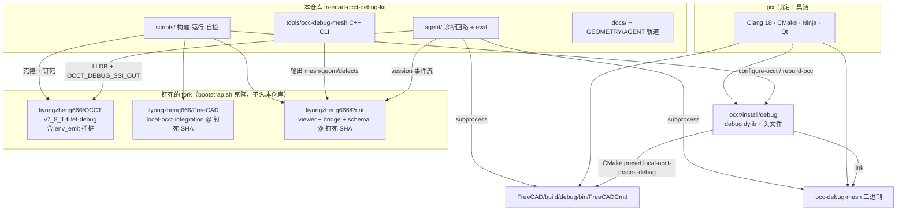
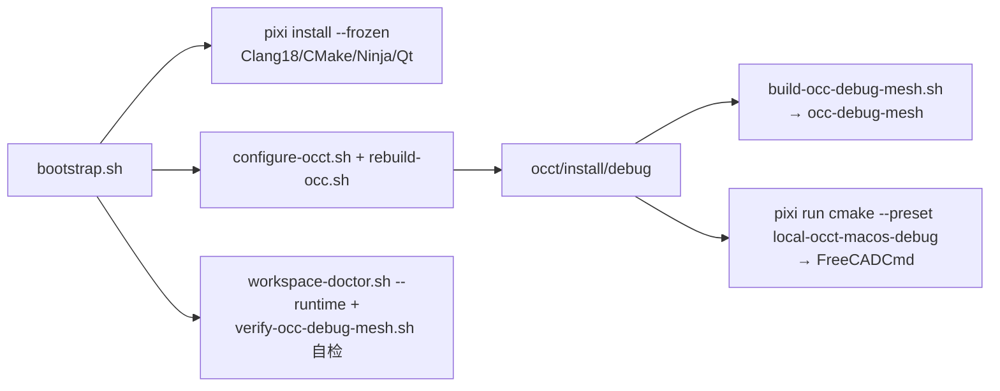

# 依赖关系图（Dependencies）——唯一权威源

> 本文档是 FreeCAD/OCCT 依赖关系的**唯一权威说明**。版本钉板以 `scripts/bootstrap.sh` 为真源；本文档与其它文档冲突时，以 bootstrap.sh 实际钉的值 + `scripts/workspace-doctor.sh` 校验结果为准。
> **维护范围：macOS Apple Silicon**。runtime 只在此平台支持与修复；Linux 仅用于 CI 离线单测门（无 OCCT，干净 SKIP），不承诺可运行。

## 1. 全景图



## 2. 版本钉板表（bootstrap.sh 是唯一真源）

| 组件 | 来源 | 钉死位置 | 为什么钉 | 升级影响 | 谁校验 |
| --- | --- | --- | --- | --- | --- |
| OCCT | `liyongzheng666/OCCT` fork | branch `v7_8_1-fillet-debug`（HEAD 含 `c07ae703b7` env_emit 插桩） | ①debug map 不被 strip（LLDB 可断点）②Clang18 FreeType 修复 ③`ChFi3d_Builder_0.cxx` `OCCT_DEBUG_SSI_OUT` 门控落盘两 blend 面 | 换 OCCT 版本 = 三处改动要重确认；插桩丢失则 box-r5 的 S3 capture 静默退回 untestable | `workspace-doctor.sh`（校验插桩在源码+已装 dylib） |
| FreeCAD | `liyongzheng666/FreeCAD` fork | SHA `2b7e9a6896bc9b5dc4555c2f6faa9adc0a7caf47`（`local-occt-integration` 分支） | 本地 OCCT 集成 + 与上游零 diff 可复现 | 换 FreeCAD = 重编译 + 重跑 baselines 门；边序行为可能变（STEP 边号坑） | bootstrap.sh 钉死 + eval 基线门 |
| Print | `liyongzheng666/Print` fork | SHA `98657e48aff2b0410a45f85540ee40e77dcc5ca4` | viewer/bridge/protocol schema 与 kit 接缝兼容 | 换 Print = bridge 测试 + viewer tsc + 协议 schema 校验 | bootstrap.sh 钉死 |
| 工具链 | pixi | `FreeCAD/pixi.lock`（frozen） | Clang 18 与 OCCT/FreeCAD 编译匹配 | 换工具链 = 全量重编译 | `pixi install --frozen` |
| occ-debug-mesh | 本仓库 | `tools/occ-debug-mesh/` | link `occt/install/debug`，与被调试进程同 ABI | 改 OCCT 后需重编译 | `verify-occ-debug-mesh.sh`（60 断言） |

> ⚠️ **已知漂移教训**：README 曾写 Print SHA `b69d0d19`，与 bootstrap.sh 实钉 `98657e48` 不一致（已修正）。**版本数字只信 bootstrap.sh**；发现本文档与它不一致，以 bootstrap.sh 为准并提 issue。

## 3. 构建链（从裸 clone 到可运行）



关键约束：`occt/` 与 `FreeCAD/` 必须同级（CMake preset 经 sourceParentDir/occt/install/debug 引用）；`tools/Print/` 由 bootstrap 克隆进被忽略目录。

## 4. 运行时链（agent 工具 → 二进制 → 依赖）

| agent 工具 | 跑什么 | 依赖 | 缺失时的行为 |
| --- | --- | --- | --- |
| `reproduce` | `FreeCADCmd` + `_fillet_harness.py`（env 驱动） | debug FreeCADCmd | 抛 `FileNotFoundError`，提示 bootstrap |
| `check_valid` | `occ-debug-mesh`（BRepCheck + BOPAlgo_CheckerSI） | occ-debug-mesh 二进制 + OCCT debug dylib | 抛错，**绝不静默判 valid** |
| `triage_input` / `vertex_probe` | `FreeCADCmd` + `_triage_harness.py` | debug FreeCADCmd | 返回 error 报告 → 判 untestable |
| `ssi_probe` | `FreeCADCmd` + `_ssi_harness.py`（intersectSS） | debug FreeCADCmd | error 报告 → untestable |
| `falsegreen_probe` | `FreeCADCmd` + `_falsegreen_harness.py` | debug FreeCADCmd | 抛 RuntimeError |
| `capture`（S2 现场） | LLDB 断点 + `occ_capture.py` | LLDB + debug map + 调试符号 | 无前置 → 照实 untestable |
| `capture`（S3 overlap） | env_emit：`OCCT_DEBUG_SSI_OUT` 门控 | **带插桩的 TKFillet**（fork `c07ae703b7`） | RuntimeError「blend face 未写出」→ untestable |
| `session` → viewer | events.ndjson → Print bridge → viewer | Print（bridge.py + viewer dev server） | 诊断仍产出，只是无图形 review |
| `decide_llm` | `claude -p`（claude_cli）/ 录制回放（replay）/ api（留接缝） | Claude Code 鉴权（claude_cli）；replay 零依赖零计费 | replay miss → ERROR 非 SKIP |

## 5. 「我升级了 X，会怎样」查询表

| 动作 | 风险 | 校验动作 |
| --- | --- | --- |
| 更新 OCCT fork | 插桩丢失 / ABI 变 → S3 capture 降级、occ-debug-mesh 链接失败 | `workspace-doctor.sh`；重编译 occ-debug-mesh + FreeCAD；跑 baselines |
| 更新 FreeCAD fork | 边序行为变（STEP 边号）、fillet 行为变 → eval 分数漂移 | 重跑 `run-agent-tests.sh` + `eval.sh`（baselines 门抓漂移） |
| 更新 Print | 协议 schema 不兼容 → viewer/bridge 断 | bridge 测试 + viewer tsc + `validate-events.py` |
| 更新 pixi 工具链 | 编译器变 → 全量重编译 | bootstrap 幂等重跑 |
| 更新 macOS/Xcode | dylib 解析 / LLDB 行为变 | `workspace-doctor.sh --runtime` |

## 6. 断链症状速查

| 症状 | 大概率是 |
| --- | --- |
| `FreeCADCmd 未找到` | 未 bootstrap 或 `REPRO_FREECADCMD` 指向错 |
| `occ-debug-mesh 未找到` | 未 `build-occ-debug-mesh.sh` 或 `OCC_DEBUG_MESH_BIN` 错 |
| `blend face 未写出…OCCT_DEBUG_SSI_OUT 改造？` | 本机 OCCT 无 `c07ae703b7` 插桩（fork 更新丢了）→ `workspace-doctor.sh` 确认 |
| replay 抛 `FixtureNotRecorded` | 录制目录缺该 (case,radius,tolerance,edges,op) 键——**ERROR 非 SKIP**，先 real 跑一遍录 |
| `harness 无输出` / `FreeCADCmd 超时` | 环境变量残留（TRIAGE_EDGES 等）或 REPRO_TIMEOUT_S 过小 |

## 7. 一致性自检（一条命令）

```bash
bash scripts/workspace-doctor.sh --runtime   # 布局/工具链/插桩/dylib 解析
bash scripts/verify-occ-debug-mesh.sh        # 60 项离线断言
bash scripts/run-agent-tests.sh              # agent 24 测试模块（离线可跑）
```
