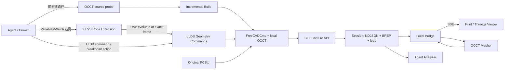
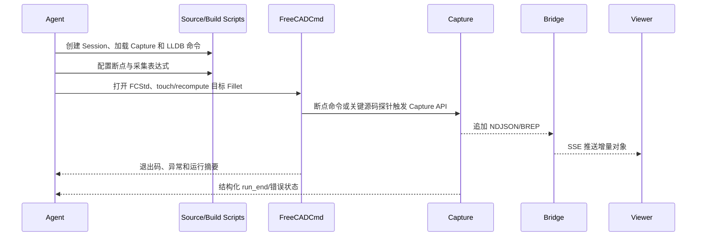

# FreeCAD / OCCT 圆角自动调试与几何可视化系统架构

> 状态：设计基线（Design Baseline）<br>
> 目标版本：MVP / 第一阶段<br>
> 运行环境：macOS Apple Silicon、FreeCAD Debug、OCCT 7.8.1、Clang/LLDB<br>
> 关联项目：[freecad-occt-debug-kit](https://github.com/liyongzheng666/freecad-occt-debug-kit)、[Print](https://github.com/liyongzheng666/Print)

## 1. 文档目的

本文定义一套用于自动分析 FreeCAD / OCCT 圆角失败问题的调试架构。它既是后续开发的设计基线，也是理解 FreeCAD、OCCT、几何采集、增量可视化和 Agent 自动化关系的学习材料。

本文重点回答：

1. 系统要解决什么问题，哪些问题暂不解决。
2. Agent、FreeCAD、OCCT、调试采集器和独立 Viewer 如何协作。
3. 点、曲线、面、Shape、UV 和原始 FCStd 文件如何被正确表达。
4. 如何在不破坏被调试进程的前提下增量输出几何。
5. OCCT 圆角算法中第一批埋点应放在哪里。
6. 两个仓库如何分工，如何构建、测试和验收。

## 2. 背景与现状

### 2.1 当前调试环境

`freecad-occt-debug-kit` 已经解决了基础调试环境问题：

- 使用固定版本的 FreeCAD 和 OCCT 7.8.1。
- FreeCAD 链接本地可修改、带调试符号的 OCCT。
- 使用 Pixi 锁定 Clang、CMake、Ninja、Qt 和其他依赖。
- 支持增量构建 OCCT、运行 FreeCADCmd、启动 FreeCAD GUI 和进入 LLDB。
- CodeLLDB 启动时加载 OCCT/Qt pretty-printer。
- 已有正常圆角和超大半径失败圆角的 smoke case。

因此，第一阶段的主要瓶颈不是“能否进入 OCCT 源码”，而是“如何把算法内部的几何状态结构化输出并与原始模型对照”。

### 2.2 Debug Visualizer 不适合承担主 Viewer

Debug Visualizer 依赖调试器停在某个栈帧后执行表达式，更适合查看树、表、简单图，而不适合本项目的主要需求：

- 无法自然维护一个持续增长的三维场景。
- 不适合增量增加、更新、删除和分组点线面。
- 无法稳定加载完整 FCStd 原始模型作为空间基准。
- 不适合显示 BRep Shape、三角面、透明实体和深度遮挡。
- 调试器继续运行或变量离开作用域后，数据生命周期难以管理。
- 不适合作为 Agent 可消费的持久化结构化输出。

Debug Visualizer 可以保留为临时查看普通变量的辅助工具，但不再作为几何调试系统的核心。

### 2.3 当前 Print 的可复用能力

当前 Print 已具备 JSON 文件加载、点和离散边显示、2D UV 与 3D XYZ 双视图、边选择、跨视图高亮、标签、搜索和重合边视觉错开。这些交互和 UV/3D 对照思路值得保留。

### 2.4 当前 Print 的结构性缺口

当前实现仍是一次性 Canvas 折线查看器，而不是几何调试场景：

- `main.js` 中 `loadDataObject()` 每次调用都会替换整个 model。
- `parser.js` 只接受非空 `points` 和 `edges`。
- `viewer.js` 使用 Canvas 2D 自己完成三维投影，没有真正的深度缓冲和三角面渲染。
- 没有增量事件、Session、分组清理、Shape 资产和原始模型。
- 边 ID 由导出顺序产生，不能关联一次运行中的稳定调试对象。
- 重合边依赖相同 `point_ids` 判断，不是几何或拓扑意义上的重合。

当前 `OCCTest/OCCDebugJsonExport.cpp` 还存在以下几何表达问题：

- 一个全局顶点只保存一组 UV；周期面缝线处，同一 3D 顶点可能对应多组 UV。
- `CurveOnSurface()` 或 3D Curve 为空时直接跳过边，会丢失退化边等重要信息。
- 固定采样数量无法兼顾大圆弧、短边和高曲率 B-Spline。
- `curve_hint` 固定写成 NURBS degree 3，与真实曲线类型不一致。
- 临时采样点 ID 和拓扑顶点 ID 共用命名空间，容易产生冲突或错误关联。
- 顺序生成的 `E0001` 不能表达 Shape occurrence、方向、Location 和父 Face。

第一阶段不能在旧 `cg_edge_export` 上继续堆字段；应定义新的调试事件协议，同时为旧数据提供一次性兼容导入。

## 3. 最终确认的目标

构建一个相对独立、但与 FreeCAD/OCCT 调试紧密连接的几何调试工具，使 Agent 能够：

1. 在 LLDB 暂停时动态输出当前几何，并可从 VS Code Variables/Watch 右键“发送到 Print”，不为每次观察修改源码或重新编译。
2. 将采集命令挂到断点，供 Agent 自动观察并继续运行。
3. 使用 FreeCADCmd 加载原始 FCStd 并复现圆角问题。
4. 在算法运行过程中输出点、曲线、面和 BRep Shape。
5. 将调试几何增量显示在独立 Viewer 中。
6. 以原始 FCStd 模型作为空间对照，明确调试几何的真实位置。
7. 按圆角阶段、Stripe 或问题类别分组、隐藏和清空对象。
8. 将错误状态和几何数据同时提供给 Agent 分析。
9. 对高频、极短生命周期和关键失败路径保留可选源码埋点。

目标工作流：

```text
F5 准备 Session、Bridge、Print、OccDebugCapture 和 LLDB 命令插件
        ↓
FreeCADCmd/FreeCAD 在断点暂停
        ↓
Variables/Watch 右键、人工命令、断点自动命令或少量源码埋点
        ↓
埋点输出事件、BREP 和日志
        ↓
Bridge 增量读取并推送
        ↓
Viewer 在原始模型上叠加调试点线面
```

## 4. 第一阶段范围与非目标

### 4.1 第一阶段必须完成

- 优先支持 FCStd 原始文件。
- 支持点、点集、折线、曲线、Edge、Wire、Face 和 Shape。
- 支持增量 add/update/remove。
- 支持按 group 清空和显示/隐藏。
- 支持清空整个调试场景。
- 支持原始模型与调试对象叠加。
- 支持 Normal、X-Ray 和 Solo 显示模式。
- 支持 Agent 自动编译、运行和读取结构化结果。
- 支持 `occdbg point/curve/edge/face/shape` 动态命令。
- 支持 VS Code Variables 和 Watch 右键“发送到 Print”，包含自动类型识别和显式类型选择。
- 正常 F5 自动准备 Session、Bridge、Print、Capture 和 LLDB 插件，发送操作绑定变量所属的准确栈帧。
- 支持将采集动作挂到断点并自动继续。
- 通过 patch 管理少量稳定 OCCT 埋点。
- Viewer 未启动时，被调试程序仍能正常运行。

### 4.2 第一阶段明确不做

- 不通过 DAP 对 CodeLLDB 实现 Agent 高层自动驾驶；但允许 Kit 的轻量 VS Code 扩展使用公开 DAP 请求，把右键变量发送到当前暂停栈帧中的 `occdbg`。
- 不要求每次观察变量都修改 OCCT 源码。
- 不实现调试时间轴和任意时刻回放 UI。
- 不把浏览器作为 BRep 几何内核。
- 不在浏览器中用不同版本的 OCCT WASM 重新解释权威几何。
- 不承诺调试实体 ID 跨进程或跨拓扑修改持久稳定。
- 不尝试一次性覆盖 OCCT 全部算法。
- 不修改或保存用户原始 FCStd 文件。
- 不把 Debug Visualizer 改造成三维 Viewer。

Session 使用追加事件并可以在重新连接后恢复当前场景，但这只是崩溃恢复和状态重建，不等价于面向用户的时间回放功能。

## 5. 需求与设计映射

| 编号 | 需求 | 设计响应 | 验证方式 |
| --- | --- | --- | --- |
| R1 | 调试时任意输出当前几何 | LLDB 动态命令 + 一次性 Capture 动态库 | 不修改源码即可输出当前 `gp_Pnt` 和 `TopoDS_Shape` |
| R2 | 增量插入点线面 | NDJSON 事件流 + SSE | 运行中连续出现新对象，不替换场景 |
| R3 | 支持清空和分组 | `group`、`clear_group`、`clear_scene` | 单独清空 Stripe，不影响 baseline |
| R4 | 原始文件空间对照 | FreeCADCmd 提取 FCStd baseline | 调试对象与原始 Shape 坐标对齐 |
| R5 | 工具相对独立 | Print 独立维护协议、Bridge、Viewer | Print 可用 example Session 单独运行 |
| R6 | 与调试信息紧密结合 | 事件携带 source、phase、run、topology_ref | 点击对象可查看源码位置和算法阶段 |
| R7 | Agent 可读取 | 结构化事件、manifest 和 summary | Agent 不解析终端彩色文本即可定位失败 |
| R8 | 不干扰算法 | 文件型非阻塞采集、异常隔离 | 关闭 Bridge/Viewer 后复现结果不变 |
| R9 | 覆盖几何边界场景 | occurrence/pcurve 模型和专门测试集 | 圆柱缝线、球极点、退化边测试通过 |
| R10 | 可复现 | 固定 FreeCAD/OCCT/Print revision | bootstrap 后得到相同工具链和协议版本 |
| R11 | VS Code 无缝发送 | Variables/Watch 菜单 + frame 跟踪 + `occdbg emit` | 右键局部变量或 Watch 表达式后直接在 Print 增量出现 |

## 6. 总体架构



系统分为六层：

1. **VS Code 交互层**：Variables/Watch 右键菜单、frame 绑定、类型选择和连接状态。
2. **复现层**：FreeCADCmd 打开 FCStd，触发指定对象重计算。
3. **采集层**：LLDB Python 命令、断点自动动作和运行在被调试进程中的 C++ Capture API。
4. **持久层**：Session 目录中的事件、BREP、派生 Mesh 和日志。
5. **服务层**：Bridge 监听 Session、转换 Shape、向浏览器增量推送。
6. **展示层**：Three.js 3D 场景和保留后的 2D UV 视图。

被调试进程不直接连接浏览器，以隔离浏览器刷新、网络断开、Bridge 崩溃和前端异常。

## 7. 仓库职责与依赖方向

### 7.1 Print 仓库

```text
Print/
├── viewer/                 # TypeScript + Three.js
├── bridge/                 # Python 本地服务
├── protocol/
│   ├── event.schema.json
│   └── session.schema.json
├── examples/               # 可独立加载的 Session
├── tests/
└── README.md
```

Print 负责事件和 Session 协议、Session 监听、SSE 推送、3D/UV Viewer、分组、搜索、高亮、定位、拾取、示例数据和协议兼容测试。

Viewer 前端技术栈固定为 **TypeScript + Vite + React + Zustand + 原生 Three.js**。React 只负责中文界面和面板组合，Three.js 由独立 `SceneController` 管理；不引入 React Three Fiber，避免让几何渲染生命周期被 UI 框架隐藏。

Print 不负责 FreeCAD/OCCT 构建、ChFi3d 埋点、FCStd 重计算策略或修改 OCCT 源码。

### 7.2 freecad-occt-debug-kit 仓库

```text
freecad-occt-debug-kit/
├── tools/
│   ├── occ-debug-capture/          # C++ 采集库
│   ├── occ-debug-mesh/             # 本地 OCCT BREP→Mesh
│   ├── vscode-occ-debug/            # Variables/Watch → Print 工作区扩展
│   └── Print/                      # bootstrap 拉取，外层仓库忽略
├── patches/
│   ├── occt-debug-build.patch
│   └── occt-fillet-instrumentation.patch
├── scripts/
│   ├── occ-debug-start.sh
│   ├── lldb_occ_debug.py
│   ├── export-fcstd-baseline.py
│   ├── run-fcstd-case.sh
│   └── run_fcstd_case.py
└── .occ-debug/                     # 本地 Session，Git 忽略
```

debug-kit 负责固定 FreeCAD、OCCT 和 Print revision，构建和加载 Capture 动态库，提供 LLDB 几何命令和 VS Code 右键发送扩展，管理少量 OCCT 埋点 patch，从 FCStd 提取 baseline，执行目标对象重计算，并向 Agent 提供统一命令和结果摘要。

依赖规则：

- Print 的协议不依赖 FreeCAD 类型。
- debug-kit 可以依赖 Print 的协议版本。
- C++ Capture API 不依赖 Viewer 或 Bridge 是否在线。
- Viewer 只消费协议，不读取被调试进程内存。
- BREP 由当前本地 OCCT 产生和读取，避免内核版本差异。

## 8. FCStd、STEP 和 BREP 的角色

### 8.1 FCStd：第一阶段原始问题载体

FCStd 是完整 FreeCAD 文档，可能包含 Body、Sketch、Pad、Pocket、Fillet 等特征树，对象属性、表达式、引用和 Placement，FreeCAD 拓扑命名信息，以及一个或多个底层 OCCT Shape。

第一阶段使用 FreeCADCmd 只读打开 FCStd，定位目标圆角对象及其输入对象。若失败 Fillet 没有有效 Shape，则使用 `Base`、`BaseFeature` 或 Body 中前一个有效 Feature 作为 baseline。

### 8.2 STEP：后续外部 CAD 输入

STEP 用于来自其他 CAD 系统的中性几何和装配数据。它通常不保留 FreeCAD 参数化建模历史，因此不作为第一阶段优先入口。

### 8.3 BREP：调试过程的权威 Shape 资产

调试过程将 baseline、Fillet 输入 Shape、中间 Face/Wire/Shape、`BadShape()`、部分结果和最终结果保存为 BREP。BREP 是权威几何；用于浏览器显示的三角网格只是派生缓存，不能反向替代 BREP。

## 9. FCStd baseline 提取

`export-fcstd-baseline.py` 应通过正在构建的 FreeCADCmd 执行：

1. 以只读意图打开 FCStd。
2. 遍历具有 `Shape` 属性的对象。
3. 记录 `Name`、`Label`、`TypeId`、父对象和 Body/App::Part 层级。
4. 定位用户指定的 Fillet 对象。
5. 解析其输入对象或前驱 Feature。
6. 计算并记录全局 Placement。
7. 导出 baseline BREP 和对象元数据。
8. 关闭文档，不保存。

建议接口：

```bash
scripts/occ-debug-start.sh \
  --document myFold/problem.FCStd \
  --object Fillet \
  --baseline auto
```

`--baseline auto` 的候选顺序：

1. 用户显式指定对象。
2. Fillet 的 `Base`/`BaseFeature`。
3. PartDesign Body 中目标对象前一个有效 Feature。
4. 文档中最后一个有效、可见且包含 Shape 的对象。

若候选不唯一，脚本必须报出候选列表，不能静默选择一个可能错误的 Shape。

### 9.1 坐标和 Placement 约束

- 所有 Viewer 3D 坐标统一使用 FreeCAD/OCCT 模型空间，单位默认 mm。
- 导出器必须明确 Shape 是否已包含 Location，防止重复应用 Placement。
- 嵌套 App::Part、Body 和 Link 必须计算全局变换。
- baseline 和埋点输出必须使用同一世界坐标系。
- manifest 必须记录单位、坐标系和变换策略。

## 10. Session 模型

```text
.occ-debug/sessions/20260621-203015-a13f/
├── manifest.json
├── events.ndjson
├── assets/
│   ├── baseline-Body.brep
│   ├── input-shape.brep
│   └── bad-shape-003.brep
├── derived/
│   ├── baseline-Body.mesh
│   └── bad-shape-003.mesh
└── logs/
    ├── build.log
    ├── freecad.log
    └── bridge.log
```

manifest 至少包含：

```json
{
  "schema_version": "1.0",
  "session_id": "20260621-203015-a13f",
  "created_at": "2026-06-21T20:30:15+08:00",
  "document": "problem.FCStd",
  "target_object": "Fillet",
  "unit": "mm",
  "coordinate_system": "right_handed_z_up",
  "freecad_revision": "2b7e9a6896b",
  "occt_version": "7.8.1",
  "occt_revision": "bd2a789f1523",
  "print_revision": "<pinned-sha>"
}
```

Session 目录属于生成数据，必须加入 `.gitignore`，不能提交用户模型或可能包含商业数据的 BREP。

## 11. 增量事件协议

### 11.1 事件信封

每个事件是一行完整 JSON：

```json
{
  "schema_version": "1.0",
  "session_id": "20260621-203015-a13f",
  "run_id": "run-0003",
  "seq": 102,
  "timestamp_ns": 1782045050123456789,
  "op": "add",
  "id": "stripe-2/common-point-1",
  "group": "fillet/stripe/2/common-points",
  "kind": "point",
  "geometry": {"x": 12.3, "y": 4.5, "z": 6.7},
  "style": {"color": "#ff3155", "size": 8, "depth_mode": "xray"},
  "source": {
    "file": "src/ChFi3d/ChFi3d_Builder_2.cxx",
    "line": 620,
    "function": "ChFi3d_Builder::CallPerformSurf",
    "phase": "perform-surface"
  }
}
```

### 11.2 操作类型

| op | 含义 |
| --- | --- |
| `add` | 增加新对象；ID 已存在时默认报协议错误 |
| `update` | 更新现有对象的几何、元数据或样式 |
| `remove` | 删除一个对象 |
| `clear_group` | 删除指定 group 及其子 group 中的调试对象 |
| `clear_scene` | 删除除受保护 baseline 外的全部调试对象 |
| `set_visibility` | 设置 group 或对象可见性 |
| `highlight` | 高亮对象集合 |
| `focus` | 请求 Viewer 定位对象或包围盒 |
| `note` | 记录无几何的算法说明、警告或错误 |
| `run_end` | 标记本次运行结果和摘要 |

事件严格按 `run_id + seq` 排序。Bridge 必须忽略已处理的重复序号，并在发现序号缺口时报告诊断信息。

### 11.3 几何类型

第一阶段支持 `point`、`point_set`、`vector`、`polyline`、`curve`、`edge`、`wire`、`surface_patch`、`face`、`shape` 和 `bbox`。

无限曲线和无限曲面不能直接显示。调用者必须提供有限参数范围；缺少有效范围时，采集器输出 `note`，不能在内部任意猜测裁剪范围。

### 11.4 大对象资产

点和短折线可以内嵌 JSON。Face 和 Shape 使用资产引用：

```json
{
  "op": "add",
  "id": "fillet/bad-shape-3",
  "group": "fillet/failure",
  "kind": "shape",
  "asset": {
    "format": "occt-brep",
    "path": "assets/bad-shape-003.brep",
    "sha256": "..."
  }
}
```

写入顺序必须是：

```text
写临时资产 → flush/close → 原子 rename → 追加引用事件
```

## 12. 几何和拓扑身份

系统必须区分：

1. **事件对象 ID**：用于 add/update/remove，只在一个 Session/Run 内稳定。
2. **OCCT Shape identity**：TShape、Location、Orientation 形成的运行时身份。
3. **FreeCAD element name**：如 `Edge3` 或 mapped element name，用于关联文档语义。

三者不能混为一个 ID。建议 topology_ref：

```json
{
  "freecad_object": "Pad",
  "freecad_element": "Edge3",
  "occurrence_path": "Pad/Solid1/Face4/Edge3",
  "shape_type": "EDGE",
  "orientation": "REVERSED",
  "location_hash": "...",
  "runtime_tshape": "0x0000000123456780"
}
```

`runtime_tshape` 只用于同一次进程运行中的诊断，不能持久化为跨运行拓扑命名；内存地址还可能在对象释放后复用。同一个底层 TShape 可以带不同 Location 或 Orientation 出现在多个位置，因此事件表达 Shape occurrence，而不是只表达裸 TShape。

## 13. UV、Pcurve 与周期面

UV 不属于全局三维顶点，而属于“边在某个面上的表示”：

```text
TopoDS_Face
  └── Edge occurrence
        ├── 3D curve/range
        ├── orientation in face
        └── pcurve on this face/range
              └── sampled UV points
```

新协议不能继续使用一个 point 同时存 XYZ 和唯一 UV。建议表达：

```json
{
  "kind": "edge_on_face",
  "face_id": "support-face-1",
  "edge_id": "edge-occurrence-4",
  "orientation": "REVERSED",
  "curve3d": {"range": [0.0, 1.0], "asset": "..."},
  "pcurve": {
    "range": [0.0, 1.0],
    "uv_polyline": [[6.28, 0.0], [6.28, 10.0]]
  }
}
```

这能够覆盖圆柱和圆锥的 U 周期缝线、球面的极点和退化边、同一 Edge 在闭合面上的两条 Pcurve、同一 3D 顶点在不同 Face 上的不同 UV，以及 REVERSED Edge 的参数方向。

## 14. Capture Core 与动态调用

Capture Core 是所有生产方式共享的底层：

```text
VS Code Variables/Watch ─► LLDB 动态命令 ─┐
手工 LLDB 动态命令 ──────────────────────┤
断点自动命令 ────────────────────────────┼──► OccDebugCapture ──► Session
OCCDBG_* 源码宏 ─────────────────────────┘
```

优先级是：人工探索使用 LLDB 动态命令；Agent 对已知位置重复观察使用断点自动命令；高频循环、极短生命周期和异常前关键状态使用源码宏。完整命令、加载、安全和验收设计见 [LLDB 动态几何采集设计](lldb-dynamic-geometry-capture.md)。

动态命令示例：

```text
(lldb) occdbg group fillet/stripe/2
(lldb) occdbg point P1 -- CP.Point()
(lldb) occdbg face support-1 -- HS1->Face()
(lldb) occdbg shape current -- myShape
(lldb) occdbg clear fillet/stripe/2
```

简单值由 LLDB Python 通过 SBValue 读取；Shape、Curve、Face 和 BREP 由目标进程内一次性加载的 `libOccDebugCapture.dylib` 处理。Capture 动态库 API 不变时，观察不同变量无需重新编译。

第一版不能只交付 Debug Console 命令。Kit 同时提供轻量 VS Code 扩展，在 Variables 和 Watch 中注册“发送到 Print”。扩展读取 `evaluateName` 或原始 Watch 表达式，通过公开的调试适配器跟踪接口维护 `variablesReference → {frameId, threadId, frameIndex}` 映射，再在准确 frame 调用 `occdbg emit`。它绝不把格式化后的 `value` 文本当作表达式，也不直接连接浏览器；完整设计、边界和测试见 [VS Code 一键发送几何到 Print](vscode-send-to-print.md)。

### 14.1 C++ Capture API

建议调用形式：

```cpp
OCCDBG_GROUP("fillet/stripe/2");

OCCDBG_POINT("common-point-1", aPoint);
OCCDBG_POINTS("section-points", aPoints);
OCCDBG_CURVE("intersection", aCurve, first, last);
OCCDBG_EDGE("selected-edge", anEdge);
OCCDBG_FACE("support-face-1", aFace);
OCCDBG_SURFACE("blend-surface", aSurface, u1, u2, v1, v2);
OCCDBG_SHAPE("bad-shape", badShape);
OCCDBG_NOTE("PerformSurf returned false");
OCCDBG_CLEAR_GROUP("fillet/stripe/2");
```

建议显式上下文：

```cpp
OccDebug::Scope scope({
    .group = "fillet/stripe/2",
    .phase = "perform-surface",
    .source = OCCDBG_SOURCE_LOCATION
});
```

### 14.2 编译关闭

```cpp
#if defined(OCC_DEBUG_CAPTURE)
#  define OCCDBG_POINT(...) ::OccDebug::EmitPoint(__VA_ARGS__)
#else
#  define OCCDBG_POINT(...) ((void)0)
#endif
```

关闭采集宏后不得求值几何表达式、创建字符串或临时 Shape、写文件或改变异常和时序行为。

### 14.3 运行时过滤

```bash
OCC_DEBUG_SESSION=/path/to/session
OCC_DEBUG_GROUPS=fillet/input,fillet/stripe/2,fillet/failure
OCC_DEBUG_MAX_EVENTS=100000
OCC_DEBUG_CURVE_DEFLECTION=0.01
OCC_DEBUG_MESH_DEFLECTION=0.05
```

稳定埋点长期保留，通过 group 过滤减少开销。Agent 临时插入的实验埋点必须位于可识别的生成块内，避免误删用户源码修改：

```cpp
// OCCDBG_AGENT_BEGIN probe-17
OCCDBG_POINT("candidate", aPoint);
// OCCDBG_AGENT_END probe-17
```

## 15. 被调试进程的安全约束

Capture API 必须遵守：

- 任何采集异常都在内部隔离，不传播到 OCCT。
- 不启动 HTTP Server，不直接连接浏览器。
- 不等待 Bridge 确认。
- 不在持有 OCCT 关键锁时执行昂贵三角化。
- BREP 写入设置大小和数量上限。
- 多线程写事件使用互斥或单写入队列，保证一行 JSON 不交叉。
- 进程异常退出后，已完整落盘的事件仍可读取。
- Session 未配置时，所有 API 立即返回。

## 16. BREP 到 Viewer Mesh

浏览器不直接解释 BREP。Bridge 发现新 BREP 后调用 `occ-debug-mesh`：

```text
C++ Capture 快速输出 BREP
          ↓
Bridge 发现资产
          ↓
occ-debug-mesh 使用同一套本地 OCCT 7.8.1
          ↓
BRepMesh_IncrementalMesh
          ↓
提取 Poly_Triangulation + TopLoc_Location
          ↓
positions / normals / indices
          ↓
Three.js BufferGeometry
```

必须正确处理 Face Orientation 导致的三角形绕序、`BRep_Tool::Triangulation(face, location)` 返回的 Location、缺失三角网格时执行 meshing、法向量和 REVERSED Face、不同模型尺度下的 deflection，以及空 Shape、无效 Shape和部分结果。

BREP 是权威资产，Mesh 放在 `derived/` 下，可随时删除重建。

## 17. Bridge 设计

第一阶段推荐 Python 异步 HTTP 服务，职责是：

- 绑定 `127.0.0.1`，不暴露到局域网。
- 读取 manifest。
- 增量 tail `events.ndjson`。
- 检查 schema、序号和资产路径。
- 异步生成缺失 Mesh。
- 通过 SSE 向 Viewer 推送事件。
- Viewer 重连时根据 Last-Event-ID 补发事件。
- 提供当前场景快照，避免前端必须从零重放超大事件文件。

选择 SSE 而不是 WebSocket：当前主通道是调试端到 Viewer 的单向增量推送；浏览器的隐藏、Solo、相机操作主要是本地 UI 状态；SSE 自带断线重连和事件 ID；协议和故障处理更简单。

如果后续需要 Viewer 点击对象后控制 Agent 或调试器，再增加独立 HTTP command API。

安全要求：

- 只允许读取当前 Session 根目录内的相对路径。
- 拒绝 `..`、绝对路径和符号链接逃逸。
- 限制可读取的扩展名和响应大小。
- 默认拒绝非本机 Origin。

## 18. Viewer 设计

### 18.1 产品定位和技术栈

Viewer 同时服务于 Agent 实时输出、人类开发者主动调研，以及 Agent 无法确定问题时的人工兜底。它不是另一个 FreeCAD，也不是仅供 Agent 消费的日志终端。

主 3D 视图从 Canvas 自定义投影迁移到原生 Three.js。Mesh 使用深度缓冲和透明度，BufferGeometry 表达点、线和三角面，Raycaster 进行对象拾取。React 负责工具栏、对象树、属性检查器和 UV 面板，Zustand 负责由增量事件驱动的 Scene Store。当前 Canvas 2D UV 逻辑可改造为按需打开的独立 UV pane，但不再承担 3D Shape 渲染。

第一版 UI 使用中文；协议字段、TypeScript 类型、源码标识和 JSON 属性保持英文。

推荐源码边界：

```text
viewer/src/
├── core/
│   ├── protocol/           # 事件类型与校验
│   ├── scene-store/        # 纯 reducer + Zustand adapter
│   └── session/
├── rendering/
│   ├── SceneController.ts
│   ├── RendererRegistry.ts
│   └── renderers/
├── features/
│   ├── layers/
│   ├── inspector/
│   ├── uv-viewer/
│   ├── search/
│   └── run-compare/
└── legacy/
    └── CgEdgeExportAdapter.ts
```

新增几何类型必须通过 Renderer Registry 注册，不能在主 Viewport 中不断扩展 `switch(kind)`。

### 18.2 界面布局

```text
┌──────────────── Session / 状态 / 搜索 / 3D·UV / X-Ray ────────────────┐
│ FreeCAD/分组树 │                    3D 主视图             │ 属性检查器 │
│ baseline 🔒    │                                          │ 几何/拓扑 │
│ Body / Pad     │                                          │ FreeCAD   │
│ Stripe / Error │                                          │ 源码位置  │
├────────────────┴──────────────────────────────────────────┴───────────┤
│ 按需展开的 UV 视图 / 运行日志 / 错误摘要                              │
└──────────────────────────────────────────────────────────────────────┘
```

- 3D 是默认主视图，UV 默认关闭，通过按钮开启或关闭。
- 左侧只显示适度简化的 FreeCAD 对象层级和调试分组，不复刻完整 FreeCAD 特征编辑器。
- 右侧检查器展示完整调试属性：ID、几何类型、参数范围、Orientation、Location、Tolerance、FreeCAD element、OCCT 类型和源码位置。
- 页面运行于 localhost 浏览器；MVP 不做 Electron、FreeCAD 内嵌面板或 VS Code 专用 WebView。
- UI 采用高信息密度的工程调试器布局，面板可折叠，不使用卡片式 Dashboard。

### 18.3 场景规模和扩展策略

MVP 按每次几百到几千对象的中等规模设计：点集和同组线条尽量合并为 BufferGeometry；对象树使用虚拟滚动；标签默认只显示选中对象和重点对象；拾取按可见层和类型过滤。

旧 Print 仓库继续复用，但采用“保留仓库、替换核心”的迁移方式：保留测试数据、UV/3D 联动思路、搜索、高亮和标签策略；替换 Canvas 3D Renderer、`parseModel()`、`setModel()` 全量状态和重复的 `app.js`。旧 `cg_edge_export` 通过兼容适配器导入，不再作为新协议扩展基础。

### 18.4 场景层级

场景层级：

```text
Scene
├── baseline                 # 灰色半透明，受保护
├── fillet/input
├── fillet/selected-edges
├── fillet/stripe/1
│   ├── spine
│   ├── support-faces
│   ├── surfaces
│   └── common-points
├── fillet/stripe/2
├── fillet/intersections
└── fillet/failure
```

必要交互：

- group tree：显示、隐藏、Solo、清空。
- 按 ID、label、phase、FreeCAD element 搜索。
- 3D 拾取和信息面板。
- 显示源码文件、行号、函数和算法阶段。
- 定位到点、线、面或 Shape 包围盒。
- baseline 透明度调整。
- Normal/X-Ray 切换。
- 线宽、点大小和标签切换。
- 3D 与 UV 跨视图选中同步。

分组节点支持显示/隐藏、Solo、锁定、清空、透明度、Normal/X-Ray 和定位包围盒。MVP 不提供任意创建、重命名和拖动分组；分组语义由 Agent/埋点协议产生。

Viewer 到 Agent 的反向控制不进入 MVP。第一版只提供复制对象 ID、复制 JSON、复制 `file:line` 和定位源码信息；后续再通过独立 command API 增加双向控制。

新 Run 默认清除旧调试对象并保留 baseline。用户可固定一个 Run，与下一次运行进行最多双 Run 对比；这仍不等价于完整时间轴。

默认不修改真实几何坐标来错开重合边。使用颜色、虚线、描边和闪烁区分；另提供明确标记的 `visual separation` 模式，偏移只属于样式，不写回权威几何。

## 19. 分组与清空语义

推荐 group：

```text
baseline
fillet/input
fillet/selected-edges
fillet/stripe/1
fillet/stripe/2
fillet/common-points
fillet/intersections
fillet/corners
fillet/failure
```

规则：

- `clear_group("fillet/stripe/2")` 同时清除全部子 group。
- baseline 默认受保护，`clear_scene` 不清除 baseline。
- 清除 baseline 需要显式 `include_protected=true`。
- UI 本地隐藏不产生协议事件；算法或 Agent 发出的可见性命令才持久化。
- 新 Run 默认清空旧调试 group，但可选择保留 baseline。

## 20. Agent 自动化流程

第一阶段不让 Agent 通过 DAP 自动驾驶 VS Code。Agent 通过 LLDB batch commands、断点动作和运行脚本控制；VS Code 扩展使用 DAP 的范围只限于人类右键发送变量和精确绑定 frame。只有动态方式无法可靠捕获的关键路径才修改源码：



建议入口：

```bash
scripts/run-fillet-agent.sh \
  --document myFold/problem.FCStd \
  --object Fillet \
  --groups fillet/input,fillet/stripe/2,fillet/failure \
  --open-viewer
```

脚本阶段：校验工作区和 Capture 动态库，创建 Session，提取 baseline，生成 LLDB breakpoint commands，运行 FreeCADCmd，收集退出码/异常/StripeStatus/BadShape，最后写 `run_end` 和机器可读 summary。只有使用源码探针或修改算法时才增量构建受影响 target。

## 21. 增量构建策略

修改 `ChFi3d` 时优先构建 `TKFillet`：

```bash
cmake --build occt/build/debug --target TKFillet -j 8
cmake --install occt/build/debug
```

实际脚本需验证生成器和 install 行为；如果 `cmake --install` 扫描全部目标，也应只重链接发生变化的库。只有 Capture API 改变 FreeCAD 直接依赖的接口/链接关系、FreeCAD 侧 runner/C++ 集成变化，或本地 OCCT ABI 不兼容时才重编 FreeCAD。

普通 `ChFi3d` 埋点或算法修改不应触发 FreeCAD 全量构建。

## 22. Patch 管理

外层 debug-kit 忽略 `occt/` 和 `FreeCAD/`，它们拥有独立 Git 历史。直接修改 `occt/src/...` 不会被外层仓库记录。Patch 是外层仓库保存的文本差异，可在 bootstrap 后重新应用。

第一阶段增加：

```text
patches/occt-fillet-instrumentation.patch
```

Patch 只保存稳定 include、Capture hook 和必要的 OCCT CMake 链接修改。Capture 库、Bridge 和 Viewer 不能放进 Patch。

bootstrap 应执行正向/反向检查：

```bash
git -C occt apply --check ../patches/occt-fillet-instrumentation.patch
git -C occt apply ../patches/occt-fillet-instrumentation.patch
```

如果正向检查失败但反向检查成功，说明 Patch 已应用，应跳过。两者都失败说明源码版本变化或存在冲突，必须停止并报告。

当埋点扩展到大量文件或多个 toolkit、需要长期维护公开 API、Patch 经常因升级冲突，或修改已演变为正式算法修复时，应迁移到自己的 OCCT fork 分支。

## 23. OCCT 圆角调用链和第一批埋点

OCCT 7.8.1 主要路径：

```text
BRepFilletAPI_MakeFillet::Build
  └── ChFi3d_Builder::Compute
      ├── UpdateTolesp / ExtentAnalyse
      ├── PerformSetOfSurf
      │   ├── StartSol
      │   ├── CallPerformSurf
      │   │   └── PerformSurf
      │   ├── ComputeData / CompleteData
      │   └── MakeExtremities
      ├── PerformFilletOnVertex
      │   ├── PerformIntersectionAtEnd
      │   ├── PerformTwoCorner
      │   ├── PerformThreeCorner
      │   └── PerformMoreThreeCorner
      ├── ChFi3d_StripeEdgeInter
      ├── ChFi3d_FilDS
      ├── CompleteDS
      └── reconstruction / SetRegul
```

### 23.1 `BRepFilletAPI_MakeFillet::Build`

输出输入 Shape、被选中的 Edge 和半径、contour 数量和闭合状态、`IsDone()`、`HasResult()`、最终 Shape 或 BadShape、FaultyContour、FaultyVertex 和 StripeStatus。

### 23.2 `ChFi3d_Builder::Compute`

输出 Stripe 列表和 Spine，`PerformSetOfSurf` 开始/完成/异常，`badstripes`、`badvertices`，进入 corner/FilDS/reconstruction 的阶段标记，以及失败前最后一个有效部分结果。

### 23.3 `StartSol` / `CallPerformSurf`

输出两个支撑 Face、Guide/Spine、两侧起始 UV、`First`/`Last` 和步长/挠度参数、Face/Stripe orientation、`Choix`、Inside、forward，以及 `PerformSurf` 返回值和求解区间变化。

### 23.4 `ChFiDS_SurfData`

输出 `IndexOfS1/S2`、生成 Surface index、两侧 FaceInterference、四个 CommonPoint、Spine 参数范围、两侧 2D points、TwistOnS1/S2 和 First/Last extension。

### 23.5 端部和 corner

重点函数为 `PerformIntersectionAtEnd`、`PerformTwoCorner`、`PerformThreeCorner` 和 `ChFi3d_StripeEdgeInter`。输出参与运算的 Stripe、支撑面、交线、交点和半径。对于 `StripeEdgeInter : fillets have too big radiuses` 等异常，应在抛出前输出两个 Stripe 及相关 SurfData。

## 24. 错误与运行摘要

Agent 不应只依赖 `StdFail_NotDone` 字符串。每次运行生成 summary：

```json
{
  "run_id": "run-0003",
  "status": "failed",
  "phase": "stripe-intersection",
  "exception_type": "StdFail_NotDone",
  "message": "StripeEdgeInter : fillets have too big radiuses",
  "faulty_contours": [2],
  "faulty_vertices": ["Pad/Vertex7"],
  "bad_shape": "assets/bad-shape-003.brep",
  "last_event_seq": 183
}
```

错误等级：

- `info`：正常阶段和几何说明。
- `warning`：缺失 3D Curve、采样范围被截断、无可用 Mesh。
- `algorithm_failure`：OCCT 正常报告不可构造。
- `capture_failure`：采集失败，但不影响算法。
- `infrastructure_failure`：构建、动态库或 FCStd runner 失败。

## 25. 性能与资源控制

第一阶段设置单次运行事件数、单个 BREP 大小、Session 总大小、点集/曲线采样数、并发 Mesh 转换数，以及 Viewer 可见对象和标签数量上限。

采样策略：

- 曲线优先按 deflection 自适应离散，不固定为 20 点。
- 极短边至少保留端点和拓扑元数据。
- 高曲率区域增加采样。
- Point/Curve 参数和 BREP 保留权威值，采样仅用于显示。
- 大 Shape 的 meshing 在 Bridge 侧异步完成，不阻塞算法关键路径。

## 26. 测试计划

### 26.1 协议测试

- 连续 add 不替换已有场景。
- update 不改变对象身份。
- remove、clear_group 和 clear_scene 语义正确。
- baseline 受保护。
- Bridge 重连后恢复当前场景。
- 重复 seq 被忽略，缺失 seq 被报告。
- 半行 NDJSON 不导致已完成事件丢失。
- 资产 hash 和路径校验失败时安全降级。

### 26.2 几何测试

- gp_Pnt、向量和点集。
- 直线、圆、椭圆、Trimmed Curve 和 B-Spline。
- 平面、圆柱、圆锥、球面和圆环面。
- 带孔 Face。
- 圆柱缝线及同一 Edge 的双 Pcurve。
- 球面极点和退化边。
- 无 3D Curve 的 Edge。
- REVERSED/INTERNAL/EXTERNAL orientation。
- 带 TopLoc_Location 的 Shape。
- 嵌套 Placement 和 Link。
- 无效 Shape、空 Shape 和部分结果。

### 26.3 FCStd 测试

- Part Fillet。
- PartDesign Fillet。
- Body 内前驱 Feature baseline。
- App::Part 嵌套。
- Fillet.Shape 为空。
- 多个 baseline 候选时停止并报告。
- 原始文档在运行前后 hash 不变。

### 26.4 圆角测试

- 10 mm box 的 2 mm 成功圆角。
- 10 mm box 的 20 mm 失败圆角。
- 多边连续圆角和相切边链。
- 两面端点、两边/三边/多边 corner。
- 变半径圆角。
- 极短边和接近容差的边。
- Stripe 相互干涉。
- `HasResult()` 为真但整体 `IsDone()` 为假的部分结果。

### 26.5 故障隔离测试

- Viewer 或 Bridge 未启动/运行中退出。
- Session 目录只读或磁盘空间不足。
- Mesh 转换失败。
- 被调试进程崩溃。
- Capture 编译宏完全关闭。

### 26.6 VS Code 发送测试

- Variables 局部变量、嵌套成员和 Watch 返回值表达式。
- 自动类型识别与 Point/Curve/Edge/Wire/Face/Shape 显式类型回退。
- 递归调用中的同名变量和多线程非 top frame，验证不会发送错误 frame 中的几何。
- 空 Handle、Null Shape、`<optimized out>`、运行态目标和 Capture 未加载。
- Bridge/Viewer 离线时先持久化，重连后对象恢复。
- CodeLLDB `commands` 和 `evaluate` console mode。

## 27. 验收标准

MVP 完成需同时满足：

1. 能只读加载 FCStd 并显示正确 baseline。
2. 点、线、Face、Shape 能在运行期间增量出现。
3. 支持按 Stripe/阶段分组、隐藏、Solo 和清空。
4. baseline 与调试几何在同一世界坐标中对齐。
5. Viewer/Bridge 关闭时 FreeCADCmd 仍能复现相同结果。
6. 修改 ChFi3d 后无需重编 FreeCAD 即可运行新 OCCT。
7. 20 mm 失败案例可显示选中边、失败 Stripe、支撑面和 BadShape。
8. 周期面、退化边和多个 UV 不再使用全局点单 UV 模型。
9. Agent 能读取结构化 summary，不依赖人工阅读终端输出。
10. 原始 FCStd 在运行前后未改变。
11. bootstrap 能恢复相同 FreeCAD、OCCT、Print 和埋点版本。
12. VS Code Variables 和 Watch 都能右键发送几何到 Print，且无需修改源码或重新编译。
13. 递归 frame、多线程和同名变量场景能够绑定正确栈帧；无法确定时明确拒绝而不是静默猜测。
14. 正常 F5 能自动准备 Session、Bridge、Print、Capture 和 LLDB 插件。

建议非功能目标：普通点/线事件从落盘到 Viewer 出现的本机延迟小于 500 ms；Viewer 首次加载中等规模 baseline 时保持可交互；Capture 关闭时不引入可观测算法行为变化。

## 28. 实施里程碑

### M0：协议和骨架

定义 event/session JSON Schema，建立 Session fixtures，明确 ID、group、UV occurrence 和错误模型。

### M1：独立增量 Viewer

Print 重构为 Three.js Viewer；Bridge tail NDJSON 并通过 SSE 推送；支持 point/polyline/mesh、group 和 clear；保留 2D UV pane 核心交互。

### M2：FreeCAD baseline 和 Shape 管线

实现 FCStd baseline、Capture 动态库、`occdbg point/shape`、BREP 资产、本地 OCCT Mesh 转换和 world placement 对齐测试；同时交付 Kit 的 VS Code 扩展，使 Variables/Watch 可右键发送，正常 F5 自动准备 Session、Bridge、Print 和调试插件。M2 是第一版端到端闭环的完成门槛。

### M3：动态调试命令和圆角适配器

实现 `occdbg curve/edge/face/surfdata`、断点自动采集、Stripe/SurfData 适配器、失败摘要和 BadShape；只为关键失败路径加入 instrumentation patch。

### M4：Agent Runner

实现自动创建 Session、增量构建/install/运行、Agent 生成块管理、机器可读 summary 和测试矩阵。

### M5：后续增强（不属于 MVP）

增加 Agent 的 DAP 高层自动控制、批量多选发送、Hover/编辑器选区发送、STEP 输入、时间轴和多次运行对比、Viewer 到 Agent 的双向命令，以及 Chamfer/Boolean/Offset/Sewing 等算法。Variables/Watch 单变量发送不属于 M5。

## 29. 建议的 PR 拆分

1. **Print：协议、Bridge、Three.js 增量 Viewer**——不包含 FreeCAD 依赖，可独立评审。
2. **debug-kit：Session、Capture、BREP Mesh、FCStd baseline**——完成通用几何输出管线。
3. **debug-kit：VS Code Variables/Watch 发送扩展和 F5 编排**——完成第一版人类调试闭环。
4. **debug-kit：LLDB 动态命令、断点动作和 Fillet Adapter**——覆盖任意观察与圆角中间数据。
5. **debug-kit：Agent Runner、关键路径 instrumentation patch 和测试集**——完成自动复现、采集和诊断。

不要把协议重构、前端重写、OCCT patch 和 Agent 自动化塞进一个不可独立验证的大提交。

## 30. 主要风险与应对

| 风险 | 后果 | 应对 |
| --- | --- | --- |
| 埋点改变算法时序 | 难以复现原问题 | 文件型非阻塞采集、运行时过滤、关闭宏对照测试 |
| BREP/Mesh Location 处理错误 | 调试几何与 baseline 错位 | world transform 测试、记录 manifest 策略、禁止重复变换 |
| UV 仍按全局顶点保存 | 周期面诊断错误 | 强制 edge-on-face occurrence 模型 |
| 事件量过大 | 磁盘和 Viewer 卡顿 | group 过滤、事件/资产上限、异步 meshing |
| Shape ID 被误认为持久拓扑 ID | 多次运行错误关联 | run-scoped ID，单独保存 FreeCAD mapped name |
| Patch 随 OCCT 升级失效 | bootstrap 中断 | 固定 revision、apply check、达到规模后迁移 fork |
| Capture 异常传播 | 改变圆角结果 | API 内部异常隔离，采集失败只写诊断 |
| 用户模型泄漏进 Git | 商业数据风险 | Session Git ignore、提交前检查、不提交 BREP |
| Viewer 与算法内核版本不一致 | 显示和真实几何不同 | BREP/Mesh 均由本地 OCCT 7.8.1 处理 |
| VS Code 菜单参数或 frame 绑定变化 | 发送错误变量或扩展失效 | 结构校验、固定受支持版本、DAP tracker 集成测试、歧义时拒绝发送 |

## 31. 学习顺序

1. 阅读 `docs/occt-debugging.md`，理解 FreeCAD 如何加载本地 OCCT。
2. 阅读 `.vscode/launch.json` 和 `scripts/fc-lldb.sh`，理解 LLDB 只是调试执行器。
3. 阅读 `docs/vscode-send-to-print.md`，理解右键变量如何绑定 CodeLLDB 栈帧并进入统一 Capture 管线。
4. 阅读 `BRepFilletAPI_MakeFillet::Build()` 和 `ChFi3d_Builder::Compute()`。
5. 理解 `TopoDS_Shape = TShape + Location + Orientation`。
6. 理解 Face、Edge、3D Curve、Pcurve 和参数范围的关系。
7. 实现最小 point/polyline NDJSON Capture。
8. 实现 Session + SSE + Three.js 增量场景。
9. 实现 BREP 保存和 `Poly_Triangulation` 提取。
10. 完成 Variables/Watch 发送与 FCStd baseline 对齐。
11. 最后进入 SurfData、Stripe、CommonPoint 和 corner 埋点。

## 32. 术语表

| 术语 | 含义 |
| --- | --- |
| LLDB | Clang/LLVM 生态中的原生调试器 |
| CodeLLDB | VS Code 中连接 LLDB 的 Debug Adapter |
| DAP | 编辑器与 Debug Adapter 之间的调试协议 |
| DebugAdapterTracker | VS Code 扩展观察 DAP 请求/响应并维护变量与栈帧关系的公开接口 |
| FCStd | FreeCAD 文档格式，包含文档对象和底层 Shape |
| STEP | 跨 CAD 系统的标准交换格式 |
| BREP | OCCT 原生边界表示 Shape 序列化格式 |
| Shape | OCCT 拓扑对象总称，如 Edge、Face、Solid |
| TShape | Shape 底层共享拓扑实现对象 |
| Location | Shape occurrence 的空间变换 |
| Orientation | Shape 在父拓扑中的方向 |
| Pcurve | Edge 在某个 Face 参数域中的二维曲线 |
| Stripe | OCCT 圆角算法中的一条圆角带 |
| Spine | 驱动圆角带构造的边链/路径 |
| SurfData | 圆角生成面及两侧干涉等中间数据 |
| CommonPoint | 圆角中间数据中的端点/交点描述 |
| Session | 一次问题复现产生的事件、资产和日志集合 |
| SSE | 浏览器单向接收服务端事件的 HTTP 机制 |

## 33. 最终设计结论

第一阶段采用“VS Code Variables/Watch 一键发送 + LLDB 动态命令优先 + 断点自动采集 + 关键路径源码埋点 + 文件型 Session + SSE + 独立 Three.js Viewer”。

这个方案：

- 比 Debug Visualizer 更适合长期积累几何调试信息。
- 比直接在 FreeCAD GUI 中创建临时对象更独立、更容易被 Agent 控制。
- 第一版即可从 Variables/Watch 右键发送到 Print；Debug Console 是补充入口，不是唯一入口。
- Capture 动态库只需一次构建，之后可在安全断点任意输出当前变量；复杂 Shape 仍由目标进程内的同版本 OCCT 序列化。
- 通过 FCStd baseline 保留真实问题上下文。
- 通过本地 OCCT BREP 和 Mesh 管线保证显示与算法使用同一内核版本。
- 通过 occurrence/Pcurve 模型覆盖周期面、缝线和退化边等关键边界场景。
- 通过分组和清空满足当前增量查看需求，同时不给 MVP 引入时间回放复杂度。

后续实现以本文的目标、边界、协议约束和验收标准为基线。任何改变数据身份、UV 表达、坐标变换或进程隔离方式的设计，都应先更新本文并补充对应测试。
